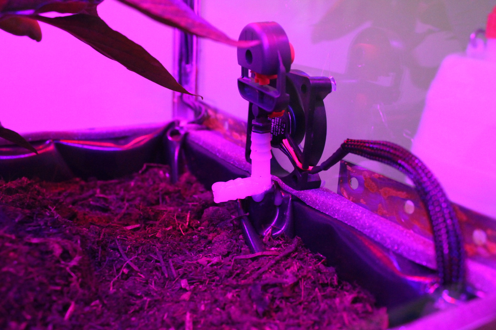

Anleitung
---------------------
Hierbei handelt es sich wie oben bereits beschrieben, um ein automatisiertes IoT Zimmergewächshaus.
Die Software als auch Hardware wurden vollständig von [Maximillian Schührer](https://github.com/prisherious/) und [Kevin German](https://github.com/Kevger) entwickelt.
Es steht jedem frei sich auf Grundlage dieser Arbeit selber ein automatisiertes Gewächshaus zu bauen.

Benötigte Materialien
---------------------
- Die benötigte Materialliste für Sensoren, Aktoren und der Platine ist auf Maximillian Schührers Repo zu finden. [Automatisiertes Gewächshaus - Materialliste](https://github.com/prisherious/Gewaechshaus/blob/master/Parts "Materialliste")
- [Raspberry PI 3 mit mind. 8 GB SD-Karte](https://www.raspberrypi.org/products/raspberry-pi-3-model-b/ "Raspberry PI 3")
- Andere Materialien wie Holz, Nägel usw für den Zusammenbau eines Gewächshauses.

Hardware
-------------------
Die Hucke-Pack Platine muss entsprechend des Layouts und Schaltplans gefertigt und bestückt werden.
Die Platine wird anschließend auf den Raspberry PI 3 aufgesteckt und die Sensoren/Aktoren an die entsprechend markierten Klemmen befestigt.
[Schaltpläne und Layouts](https://github.com/prisherious/Gewaechshaus "Schaltpläne und Layouts")
Das Gehäuse des Gewächshauses kann nach belieben gestaltet werden. 

### Taktfrequenz Feuchtigkeitssensor
Der Feuchtigkeitssensor [Giess-o-mat](https://www.ramser-elektro.at/shop/bausaetze-und-platinen/giesomat-kapazitiver-bodenfeuchtesensor-erdfeuchtesensor-mit-beschichtung/ "Giess-o-mat") liefert bei trockenem Zustand eine Frequenz von 330 KHz und bei feuchtem von etwa 10 KHz. Die steigenden (oder fallenden) Taktflanken müssen für eine Auswertung per Interrupt abgefangen und gezählt werden. Aufgrund des Schedulers und Dispatchers des auf Debian bassierenden Betriebssystems Raspbian, kommt es bei diesen hohen Frequenzen zu starken Schwankungen in den Messungen. Die Frequenz muss deswegen stark verringert werden, dafür werden hier die beiden in Reihe geschalteten Johnson-Dekaden-Zähler als Taktteiler genutzt.

Installation der Software
-------------------
1) 1-Wire und I2C in den Einstellungen des PIs aktivieren [Tutorial: 1-Wire und I2C aktivieren](https://www.raspberrypi-spy.co.uk/2018/02/enable-1-wire-interface-raspberry-pi/ "1-Wire und I2C aktivieren")
2) Node-RED auf dem Raspberry PI 3 installieren und Autostart aktivieren. [Tutorial: Node-RED Installation](https://nodered.org/docs/hardware/raspberrypi "Node-RED Installation") 
3) Installieren der benötigten Node-RED Bibliotheken: 
[DHT](https://flows.nodered.org/node/node-red-contrib-dht-sensor "Node-RED DHT")
[I2C](https://flows.nodered.org/node/node-red-contrib-i2c "I2C")
[1-Wire](https://flows.nodered.org/node/node-red-contrib-1wire "1-Wire")
4) Importieren des Node-RED Quellcodes aus diesem Repository in Node-RED.
5) Wiring-PI installieren. [Tutorial: Wiring-PI Installation](https://projects.drogon.net/raspberry-pi/wiringpi/download-and-install/ "Wiring-PI"). Wiring-PI wird für das C Programm benötigt, um die Interrupts der Pins abzufangen.
6) Kopieren des C-Programms auf den Desktop.
7) Autostart für Chromium einrichten mit 10 Sekunden Verzögerung [Tutorial: Chromium im Vollbildmodus automatisch starten](https://projects.drogon.net/raspberry-pi/wiringpi/download-and-install/ "Wiring-PI").

Nutzung
---------------------
Nach erfolgreicher Installation und Einrichtung aller Bestandteile, sollte das Gewächshaus automatisch nach anlegen einer Stromversorgung starten.
Vor einer Inbetriebnahme muss der Bodenfeuchtesensor und Lichtsensor über die erweiterten Einstellungen kalibriert werden. Diese nutzen dafür eine Zweipunktkalibrierung. Um den Bodenfeuchtesensor zu kalibrieren, muss der Sensor zuerst in die "0 %" feuchte Erde, anschließend in eine per Hand befeuchtete "100 %" feuchte Erde gesteckt werden. 
Für den Lichtsensor das gleiche Vorgehen, mit der Abdunklung und Beleuchtung des Raums.
Beide Kalibrierungen basieren auf Erfahrungswerten und müssen individuell für jede neue Konfiguration (neue Erde oder neue Position im Raum) durchgeführt werden.
Die Sollwerte und Regelparameter können über eine Toucheingabe einfach eingestellt werden.

Beispiel fertiggestelltes Gewächshaus
---------------------
Das nachfolgende Gewächshaus beinhaltet die Hard- als auch Software. 

Beispiel fertiggestellte Platine
---------------------

Beispiel Steuerung über ein Smartphone 
---------------------

