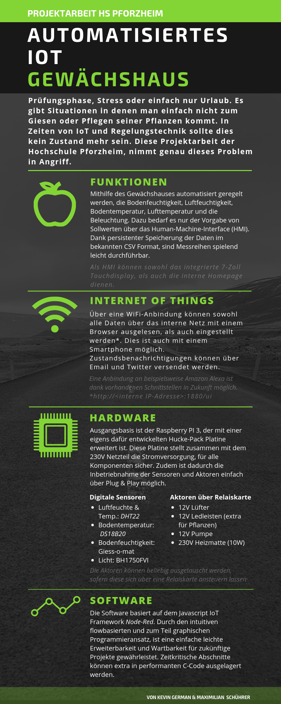

Anleitung
---------------------
Hierbei handelt es sich wie oben bereits beschrieben, um ein automatisiertes IoT Zimmergewächshaus.
Die Software als auch Hardware wurden vollständig von Maximillian Schührer und Kevin German entwickelt.
Es steht jedem frei sich auf Grundlage dieser Arbeit selber ein automatisiertes Gewächshaus zu bauen.

Benötigte Materialien
---------------------
- Die benötigte Materialliste für Sensoren, Aktoren und der Platine ist auf Maximillian Schührers Repo zu finden. [Automatisiertes Gewächshaus - Materialliste](https://github.com/prisherious/Gewaechshaus/blob/master/Parts "Materialliste")
- [Raspberry PI 3 mit mind. 8 GB SD-Karte](https://www.raspberrypi.org/products/raspberry-pi-3-model-b/ "Raspberry PI 3")
- Andere Materialien wie Holz, Nägel usw für den Zusammenbau eines Gewächshauses.

Hardware
-------------------
Die Hucke-Pack Platine muss entsprechend des Layouts und Schaltplans gefertigt und bestückt werden.
Die Platine wird anschließend auf den Raspberry PI 3 aufgesteckt und die Sensoren/Aktoren an die jeweiligen Klemmen angesteckt.
[Schaltpläne und Layouts](https://github.com/prisherious/Gewaechshaus "Schaltpläne und Layouts")

### Taktfrequenz Feuchtigkeitssensor
Der Feuchtigkeitssensor [Giess-o-mat](https://www.ramser-elektro.at/shop/bausaetze-und-platinen/giesomat-kapazitiver-bodenfeuchtesensor-erdfeuchtesensor-mit-beschichtung/ "Giess-o-mat") liefert bei trockenem Zustand eine Frequenz von 330 KHz und im Trockenen von etwa 10 KHz. Die steigenden (oder fallenden) Taktflanken müssen für eine Auswertung per Interrupt abgefangen und gezählt werden. Aufgrund des Schedulers und Dispatchers des auf Debian bassierenden Betriebssystems Raspbian, kommt es bei diesen hohen Frequenzen zu starken Schwankungen in den Messungen. Die Frequenz muss deswegen stark verringert werden, dafür werden hier die beiden in Reihe geschalteten Johnson-Dekaden-Zähler genutzt.

Software
-------------------
Die Software wurde mit Node-RED entwickelt. Ein von IBM entwickelts Framework auf Basis von Javascript, für IoT Anwendungsfälle. Dieses lässt durch den grafischen und flow-bassierten Programmieransatz eine intuitive leichte Programmierung zu. Zudem ist bereits eine Vielzahl von nützlichen IoT Bibliotheken vorhanden. Dadurch ist eine einfache Erweiterbarkeit und Wartbarkeit möglich.
Die Interrupts des Feuchtigkeitssensors werden mit einem eigenen dafür vorgesehenen C Programm abgefangen. 

### Installation
One-Wire und I2C müssen in den Einstellungen des PIs aktiviertw werden.
Node-RED muss zunächst auf dem Raspberry PI 3 installiert werden. [Node-RED Installation](https://nodered.org/docs/hardware/raspberrypi "Node-RED Installation")
Als nächstes muss Wiring-PI installiert werden. [Wiring-PI Installation](https://projects.drogon.net/raspberry-pi/wiringpi/download-and-install/ "Wiring-PI"). Wiring-PI wird für das C Programm benötigt, um die Interrupts der Pins abzufangen.
//TODO
